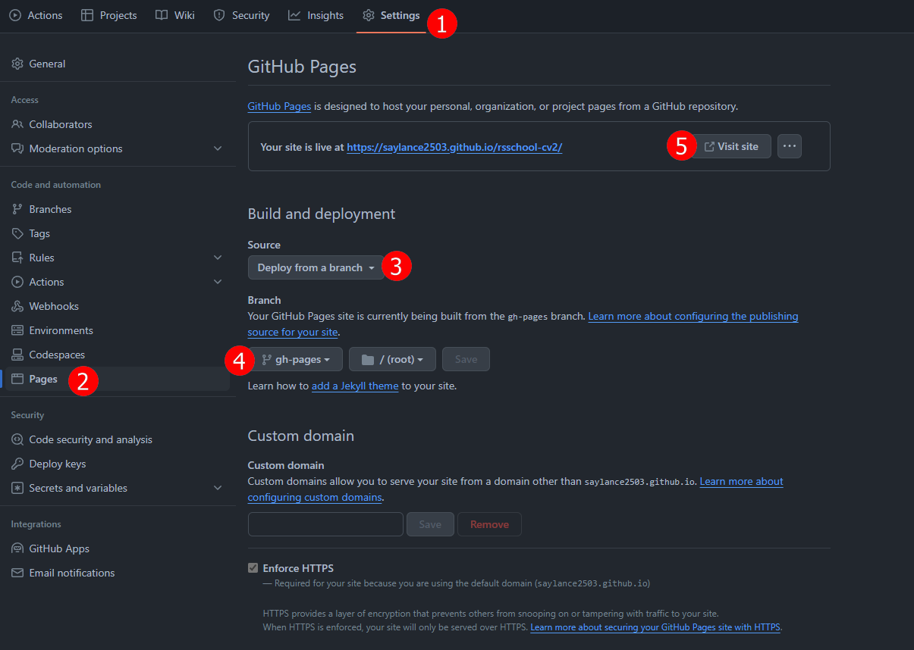

# CV#1. Markdown & Git

Ваша задача - оформить репозиторий согласно требованиям, добавить в него своё CV в формате markdown, задеплоить CV в формате markdown на GitHub Pages.

- [Описание и требования задания](cv.md)

## Порядок работы

1. В своём GitHub аккаунте создайте публичный репозиторий с названием `kiber-cv`.
   В главной ветке данного репозитория (`main`) должен находиться только один файл `README.md`.
2. От ветки `main` создайте ветку `gh-pages`.
3. В процессе работы над проектом в ветку `gh-pages` необходимо сделать не меньше 3-х коммитов. Согласно [гайдлайну](git-convention.md) название каждого коммита должно начинаться с одного из перечисленных префиксов `init:`, `feat: `, `fix: `, `refactor: `, `docs:`.
4. В ветке `gh-pages` разместите файл `cv.md`.
5. Используя markdown-разметку в файле `cv.md` создайте своё CV.  
   Требования к содержанию CV и рекомендации к его составлению перечислены в [описании задания](cv.md#содержание-cv).
6. В файл `README.md` ветки `gh-pages` добавьте ссылку вида `https://GITHUB-USERNAME.github.io/kiber-cv/cv`, в которой вместо `GITHUB-USERNAME` укажите свой никнейм на сайте GitHub. По этой ссылке должна открываться страница CV задеплоенная на GitHub Pages.
7. Создайте Pull Request из ветки `gh-pages` в ветку `main`.  
   Название Pull Request `Markdown & Git`  
   [Описание Pull Request дайте по схеме](pull-request-review-process.md).  
   Мержить Pull Request из ветки `gh-pages` в ветку `main` не нужно.

## Публикация резюме на `github-pages` (Deploy)

Для того, чтобы найти ссылку на опубликованное ранее вами резюме (и добавить её в третий пункт описания пулл реквеста):

- находясь в своём репозитории, в вверхней части найдите вкладку `Settings`, выберите пункт `Pages`, выберите `Deploy from a branch` (если не выбрано по умолчанию), выберите нашу ветку `gh-pages` и нажмите `Save`, далее можно скопировать ссылку нашего деплоя или посетить сайт
  
- сервис `gh-pages` позволяет вам публиковать ваш контент в интернете (т.е он становится публичным и кто угодно может его увидеть), в качестве контента используются файлы с расширением `.md`, однако, если в корне репозитория есть файл с расширением `index.html` то он будет использоваться в качестве главной страницы поскольку имеет более высокий приоритет по сравнению с `.md` файлами;

## Критерии оценки

**Максимальный балл за задание +50**

- выполнены требования к репозиторию +25;
- выполнены требования к коммитам и Pull Request +25.

## Материалы:

- [Шпаргалка по синтаксису Markdown](https://ydmitry.ru/blog/rukovodstvo-po-markdown-dlya-uproshcheniya-veb-razrabotki/).
